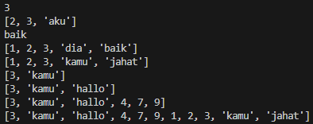

# Latihan 9 Bahasa Pemrograman
## Buat sebuah list sebanyak 5 elemen dengan nilai bebas
### Akses list:
* Tampilkan elemen ke 3
* Ambil nilai elemen ke 2 sampai elemen ke 4
* Ambil elemen terakhir

## Programnya
``````python
# Buat sebuah list sebanyak 5 elemen dengan nilai bebas
list = [1, 2, 3, "aku", "baik"]
# Tampilkan elemen ke 3
print(list[2])
#  Ambil nilai elemen ke 2 sampai elemen ke 4
print(list[1:4])
# Ambil elemen terakhir
print(list[-1])
``````
### Outputnya:


### Ubah elemen list:
* Ubah elemen ke 4 dengan nilai lainnya
* Ubah elemen ke 4 sampai dengan elemen terakhir

## Programnya
``````python
list = [1, 2, 3, "aku", "baik"]
# Ubah elemen ke 4 dengan nilai lainnya
list[3] = "dia"
print(list)
#  Ubah elemen ke 4 sampai dengan elemen terakhir
list[3:] = ["kamu" , "jahat"]
print(list)
``````
### Outputnya:


### Tambah elemen list:
* Ambil 2 bagian dari list pertama (A) dan jadikan list ke 2 (B)
* Tambah list B dengan nilai string
* Tambah list B dengan 3 nilai
* Gabungkan list B dengan list A

## Programnya
``````python
listA = [1, 2, 3, "kamu", "jahat"]
# Ambil 2 bagian dari list pertama (A) dan jadikan list ke 2 (B)
listB = listA[2:4]
print(listB)
# Tambah list B dengan nilai string
listB.append("hallo")
print(listB)
# Tambah list B dengan 3 nilai
listB.extend([4, 7, 9])
print(listB)
# Gabungkan list B dengan list A
gabungkan_list = listB + listA
print(gabungkan_list)
``````
### Outputnya :


### Output dari semua latihan diatas adalah:

